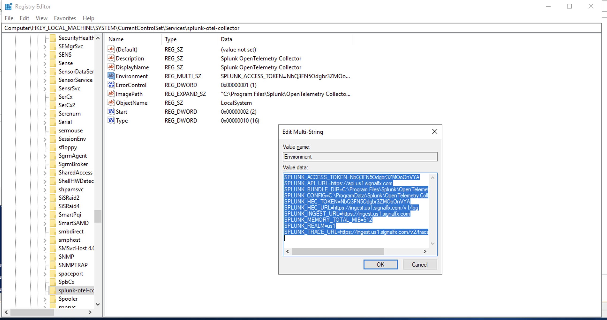

# Ingest log files on Windows machines with Open Telemetry Collector using `filelog` receiver

The OpenTelemetry Collector can ingest logs using a Filelog receiver and the Splunk HEC exporter.

## Open Telemetry Log Receiver Configuration

We will need to edit the collectors configuration file to add a new filelog reciever:

The Collector configuration is a YAML file  which specifies the behavior of the different components and services. 
By default, it’s stored in **C:\ProgramData\Splunk\OpenTelemetry Collector\agent_config.yaml**


Under receivers: create the **filelog** receiver (make sure to indent correctly):

```
receivers:
  filelog/iis:
    include:
      - 'E:\\_logfiles\\iis\\*\\*'
    start_at: beginning
    exclude_older_than: 1440m
```

The under the service: section, find the logs: pipeline, replace fluentforward with filelog and optionally remove otlp (again, make sure to indent correctly):

```
    logs:
      receivers: [filelog/iis, otlp]
      processors:
      - memory_limiter
      - batch
      - resourcedetection
      #- resource/add_environment
      exporters: [splunk_hec, splunk_hec/profiling]
```

Save the file and exit the editor.


## Open Telemetry Log Exporter Configuration


The Splunk HEC exporter is configured out of the box under the **splunk_hec** section.

# Logs
```
splunk_hec:
  token: "${SPLUNK_HEC_TOKEN}"
  endpoint: "${SPLUNK_HEC_URL}"
  source: "otel"
  sourcetype: "otel"
  index: "main"
  profiling_data_enabled: false
```


Instead of updating environment variables directly in the configuration file (although you can if you want to), based on the specified installation parameters for MSI installer, the environment variables are sourced from the registry key - HKLM:\SYSTEM\CurrentControlSet\Services\splunk-otel-collector and set on the Environment entry.

To modify any of the configuration values like SPLUNK_HEC_URL and SPLUNK_HEC_TOKEN, run regedit and browse to the path.

 "Edit registry")

